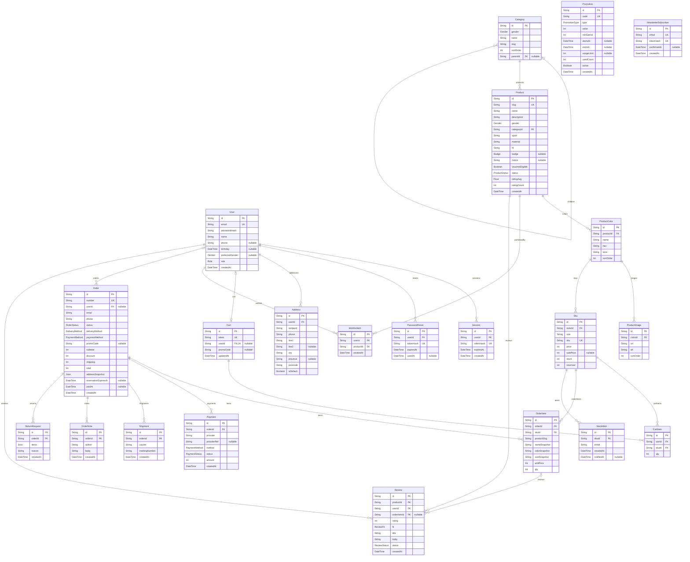

# MyWear database ERD

<!-- Generated from prisma/schema.prisma by `npm run db:erd`. Do not edit by hand. -->

22 tables, 11 enums. Money columns are integer IDR. `PK` primary key, `FK` foreign key, `UK` unique.
Crow's feet read as: `||` exactly one, `|o` zero or one, `o{` zero or many.

## Enums

| Enum | Values |
|---|---|
| Gender | `women`, `men`, `kids` |
| Role | `customer`, `admin`, `merchandiser`, `support` |
| Badge | `New`, `Sale`, `Limited` |
| ProductStatus | `draft`, `published`, `archived` |
| OrderStatus | `pending_payment`, `paid`, `processing`, `shipped`, `delivered`, `cancelled`, `return_requested`, `returned`, `refunded` |
| DeliveryMethod | `standard`, `express` |
| PaymentMethod | `card`, `ewallet`, `va` |
| PaymentStatus | `pending`, `paid`, `failed`, `refunded` |
| PromotionType | `percent`, `fixed`, `free_delivery` |
| ReviewFit | `runs_small`, `true_to_size`, `runs_large` |
| ReviewStatus | `pending`, `approved`, `rejected` |

## Reading the model

- **Catalogue**: `Product` → `ProductColor` → `Sku` (one per colour and size, carries price and stock) and `ProductImage`. Sellable quantity is `stock - reserved`.
- **Orders** keep snapshots (`OrderItem.nameSnapshot`, `Order.addressSnapshot`) so later catalogue edits never rewrite history. `OrderItem` still links its `Sku`, which is why products are archived, not deleted.
- **Checkout** raises `Sku.reserved` until payment; `Order.reservationExpiresAt` drives the release job.
- **Carts** belong to a guest (`token` cookie) or a user (`userId`, one bag per user).
- `Promotion` and `NewsletterSubscriber` stand alone: orders store the promo `code`, not a foreign key.
